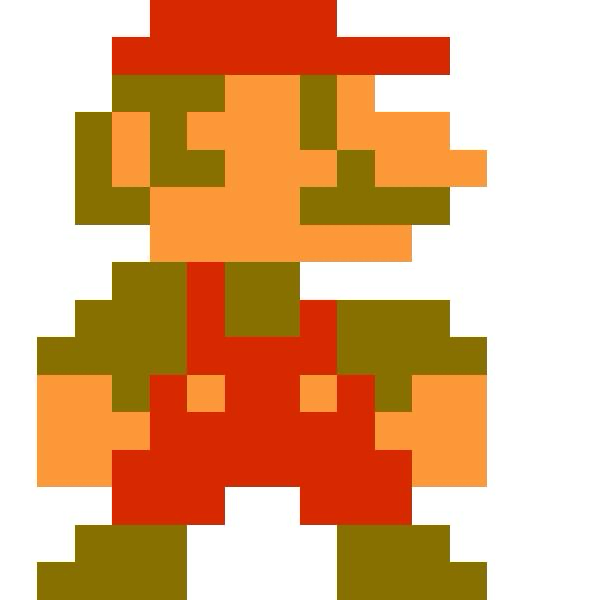
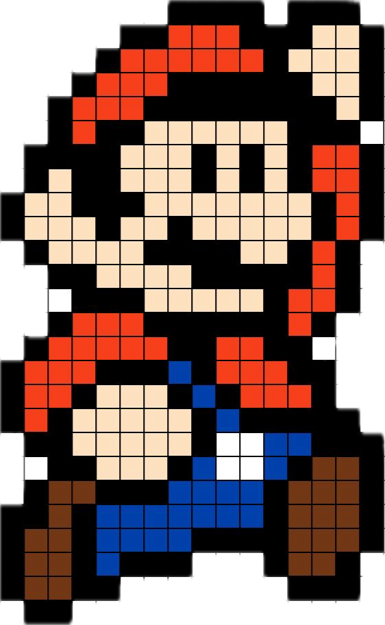
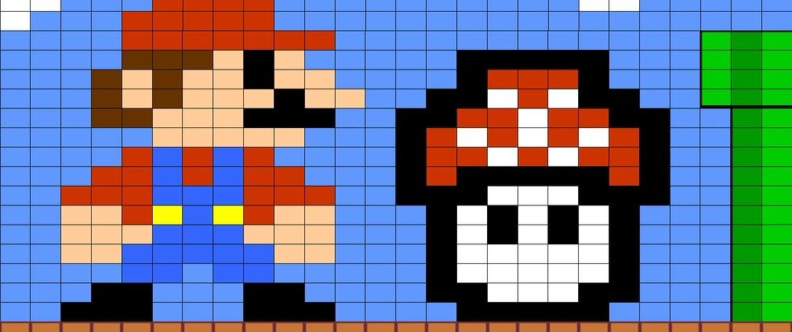

# Quiz-8

## Part 1: Imaging Technique Inspiration

### Pixel-based Game Graphics (Mario)

I am inspired by pixel-based graphics used in classic games like Mario. These images are made up of small coloured squares, where each square represents a pixel. From the images, we can clearly see how the character and environment are built using a grid structure. I would like to use this technique because it shows how complex visuals can be created from simple elements. It is also suitable for interactive design, as each square can be controlled or changed individually. This makes it useful for combining visual design and coding.

## Part 2: Coding Technique Exploration

### p5.js Pixel Colour Sampling

To recreate this effect, I will explore pixel colour sampling using p5.js. The function `img.get(x, y)` can read the colour of each pixel from an image, such as a Mario sprite. By using loops, we can draw many small shapes and assign colours to them based on the image. This allows the image to be reconstructed as a grid. This technique is useful because it supports generative and interactive design, where each element can respond to user input.

Example:
https://p5js.org/reference/p5.Image/get/

Code:
https://editor.p5js.org/codingtrain/sketches/A92PDk-1z

